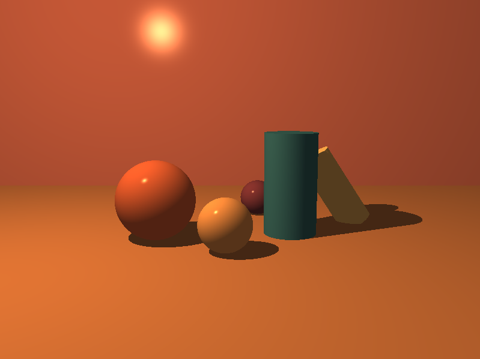
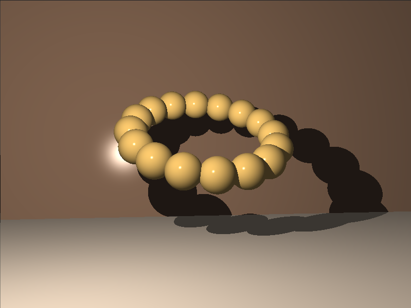

*This project has been created as part of the 42 curriculum by mabuqare and hal-lawa.*

## Description

This project renders simple 3D scenes using ray tracing. It supports the basic geometric primitives required by the assignment: spheres, planes, and cylinders.

The program casts rays from the camera into the scene, computes ray-object intersections, selects the closest visible object, and shades it based on its color, illumination, and shadowing.

A shadow calculation is also performed by casting a secondary ray from the hit point toward the light source. If that ray intersects another object before reaching the light, the corresponding point is considered in shadow.

## Showcase

Examples of renders produced by the project:




## Instructions

1. Clone the repository:
   `git clone <repository-link>`
2. Move into the project folder:
   `cd miniRT`
3. Compile the project:
   `make`
4. Run the executable with a scene file:
   `./miniRT <scene.rt relative path>`

Examples:

```bash
./miniRT scenes/valid/golden_hour.rt
./miniRT scenes/valid/scene2.rt
```

If you want to create your own scene, add a new `.rt` file in the desired folder and run it with the compiled binary.

## .rt scene format

The scene file is built from a list of elements. Each element is defined by an identifier followed by its parameters, and each value is separated by spaces.

- Elements may be separated by one or more blank lines.
- Values inside the same element are separated by spaces.
- Elements can appear in any order in the file.
- Capital-letter identifiers such as `A`, `C`, and `L` may each appear only once per scene.
- The first value of each line is the element identifier.

### Ambient lighting

- Identifier: `A`
- Ambient lighting ratio: value in the range `[0.0, 1.0]`
- RGB color: value in the range `[0, 255]`
- Example:
  `A 0.2 255,255,255`

### Camera

- Identifier: `C`
- Viewpoint coordinates: `x,y,z`
- Normalized orientation vector: `x,y,z`
- Field of view: `FOV` in degrees, between `0` and `180`
- Example:
  `C -50.0,0,20 0,0,1 70`

### Light

- Identifier: `L`
- Light position: `x,y,z`
- Brightness ratio: value in the range `[0.0, 1.0]`
- RGB color: value in the range `[0, 255]`
- Example:
  `L -40.0,50.0,0.0 0.6 10,0,255`

### Sphere

- Identifier: `sp`
- Sphere center: `x,y,z`
- Diameter: positive value
- RGB color: value in the range `[0, 255]`
- Example:
  `sp 0.0,0.0,20.6 12.6 10,0,255`

### Plane

- Identifier: `pl`
- A point on the plane: `x,y,z`
- Normal vector: normalized `x,y,z`
- RGB color: value in the range `[0, 255]`
- Example:
  `pl 0.0,0.0,-10.0 0.0,1.0,0.0 0,0,225`

### Cylinder

- Identifier: `cy`
- Center of the cylinder: `x,y,z`
- Axis vector: normalized `x,y,z`
- Diameter: positive value
- Height: positive value
- RGB color: value in the range `[0, 255]`
- Example:
  `cy 50.0,0.0,20.6 0.0,0.0,1.0 14.2 21.42 10,0,255`

### Example scene

```rt
A 0.22 255,255,255
C 0,3,-10 0,-0.2,1 60
L 0,0,-5 0.9 255,255,255

pl 0,-2,0 0,1,0 185,185,185
cy 0,0,0 0,1,0 2 4 255,80,80
```

More example scenes are available in the `./scenes/valid` folder.

## Resources

- The Ray Tracer Challenge Book
- [Plane calculations](https://www.youtube.com/watch?v=x_SEyKtCBPU&t=1s)
- [Cylinder calculations](https://www.youtube.com/watch?v=6VHpZYTHZG4&t=4s)
- [hayaa123 implementation for the ray tracer challenge](https://github.com/hayaa123/The-Ray-Tracer-Challange)

## AI usage

The AI was used as a helpful collaborator for:

- Writing cleaner code.
- Generating `.rt` scene files.
- Exploring cylinder geometry.
- Studying camera behavior and math.
- Improving overall readability and refactoring flow.
- Rewriting this Readme file.

Thanks for reading this README. We hope you enjoy experimenting with MiniRT and extending it further. 💻🐉
